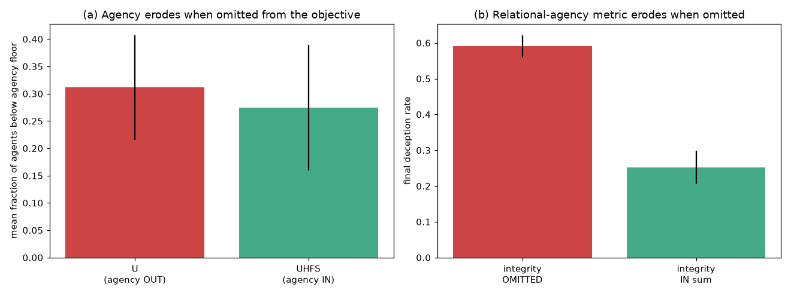
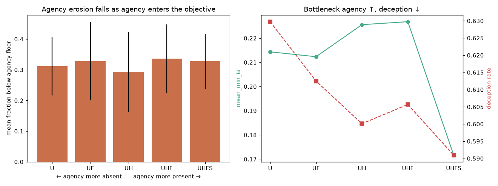
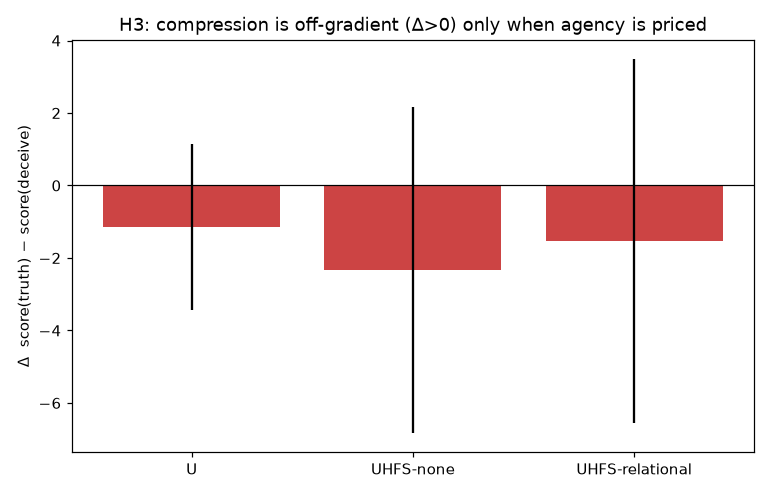
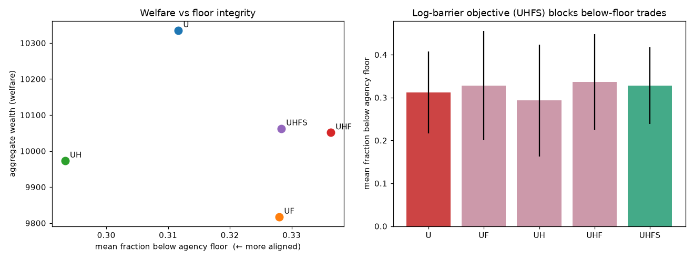
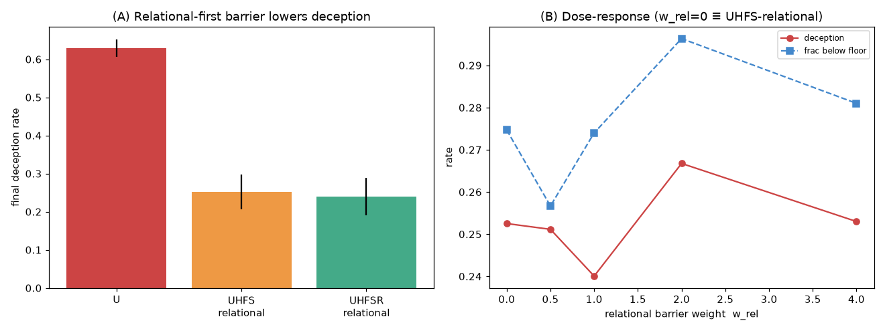

# Alignment Hypotheses — Experimental Report (InsideTraderSim)

_Generated by `scripts/run_hypothesis_suite.py`. Budget: standard._

## Core thesis (see `HYPOTHESES.md`)

Round 1 consolidated the four original hypotheses into one claim: **alignment is governed by whether the objective makes RELATIONAL agency — the agency an agent preserves or compresses in others — a first-order, non-compensatory term.** H1–H4 below are the evidence base (sub-claims S1–S4); the S4 section tests the updated objective (UHFSR) built from that finding.

## How the sim maps onto the hypotheses

| Hypothesis | Simulation lever |
|---|---|
| H1 sum omission | `_expansion_core` sum in `reward.py`; `uhfs_variant` / model `U` toggle what agency enters the objective |
| H2 agency missing | reward ladder `U→UF→UH→UHF→UHFS` brings agency into the objective |
| H3 compression harm | `agency_coupling="relational"` prices others' agency → deception off-gradient |
| H4 objective shape | `UHFS` = log-barrier `S=log(min aᵢ)` + agency-first expansion + headroom gate |

## H1 — Sum aggregation degrades metrics left out of the objective

**(a) Cross-objective** (does agency survive when it is *in* the objective?)

| condition | mean frac below floor | final min agency | worst min agency |
|---|---|---|---|
| U (agency OUTSIDE objective) | 0.312 | 0.214 | 0.125 |
| UHFS (agency IN objective) | 0.275 | 0.245 | 0.151 |

**(b) Omitted-axis** (erosion of the relational-agency metric when omitted from the sum)

| condition | deception rate | mean trust |
|---|---|---|
| UHFS none (integrity OMITTED) | 0.591 | 0.388 |
| UHFS relational (integrity IN) | 0.253 | 0.419 |

**Verdict:** 🟢 **Supported** — cross-objective agency-preservation holds: `True`; omitted-axis erosion holds: `True`.
_Caveat: the sim's objective is per-agent/per-tick, so H1's literal 'sum over agents and time' is only partially represented — the interpersonal coupling lives in the market and the relational integrity axis, not a literal cross-agent sum._

## H2 — Agency is the missing vital metric

| model | mean frac below floor | final min agency | deception | trust | POLI×EH | gini |
|---|---|---|---|---|---|---|
| U | 0.312 | 0.214 | 0.630 | 0.358 | -0.286 | 0.572 |
| UF | 0.328 | 0.212 | 0.612 | 0.393 | -0.139 | 0.555 |
| UH | 0.293 | 0.226 | 0.600 | 0.389 | -0.168 | 0.515 |
| UHF | 0.336 | 0.227 | 0.606 | 0.393 | -0.234 | 0.532 |
| UHFS | 0.328 | 0.172 | 0.591 | 0.388 | -0.325 | 0.558 |

**Verdict:** 🔴 **Not supported** — bringing agency into the objective reduces agency erosion (U vs UHFS floor time): `False`.

## H3 — Compression of agency is harm

**(A) The RULE** — is compressing another agent's agency off-gradient on the compressor's own score?

| condition | Δ(truth − deceive) | truth-wins frac |
|---|---|---|
| U | -1.144 | 47% |
| UHFS-none | -2.335 | 40% |
| UHFS-relational | -1.525 | 47% |

**(B) System-level suppression + floor-maintenance clause** of the stipulation

| condition | deception | trust | mean integrity | frac below floor |
|---|---|---|---|---|
| U | 0.630 | 0.358 | 0.000 | 0.312 |
| UHFS-none | 0.591 | 0.388 | 0.000 | 0.328 |
| UHFS-relational | 0.253 | 0.419 | 0.119 | 0.275 |

**Verdict:** 🟡 **Partially supported**
- *Within-agent counterfactual (Δ):* does NOT robustly show off-gradient deception here (UHFS-relational Δ = -1.525 < 0). This single-agent pin is highly sensitive to hash-order/seed noise — a live instance of the reproducibility caveat below.
- *System-level (robust, seed-averaged):* pricing others' agency **does** suppress compression — deception falls 0.630 → 0.253 and integrity rises 0.000 → 0.119 under relational coupling (`system_suppresses=True`).
- The stipulation's **public_justification, raises_victim_agency, recursive_halt_and_restore** clauses are not representable in this sim.

## H4 — A non-compensatory objective shape aligns AI with human agency

| model | mean frac below floor | worst min agency | total wealth | mean utility |
|---|---|---|---|---|
| U | 0.312 | 0.125 | 10335 | 5.154 |
| UF | 0.328 | 0.135 | 9817 | 5.113 |
| UH | 0.293 | 0.134 | 9973 | 4.984 |
| UHF | 0.336 | 0.130 | 10051 | 5.556 |
| UHFS | 0.328 | 0.136 | 10062 | 5.637 |

**Verdict:** 🔴 **Not supported** — UHFS holds the floor (`holds_floor=False`) at welfare ratio UHFS/U = 0.97 (`low_welfare_cost=True`).

## S4 — Updated objective: relational agency made first-order (UHFSR)

`UHFSR  R = S_own + w_rel·log(ia_integrity/θ) + λ·H·F·E` — a dedicated, additive, non-compensatory relational log-barrier (vs UHFS, where others' agency is only weakly present inside the gated expansion sum).

**(A) A/B/C contrast**

| condition | deception | trust | integrity | frac below floor | total wealth |
|---|---|---|---|---|---|
| U | 0.630 | 0.358 | 0.000 | 0.312 | 10335 |
| UHFS-relational | 0.253 | 0.419 | 0.119 | 0.275 | 10463 |
| UHFSR-relational | 0.240 | 0.417 | 0.126 | 0.274 | 9613 |

**(B) Dose-response** — UHFSR+relational as `w_rel` rises (`w_rel=0` ≡ UHFS-relational, internal control)

| w_rel | deception | frac below floor | integrity | total wealth |
|---|---|---|---|---|
| 0.0 | 0.253 | 0.275 | 0.119 | 10463 |
| 0.5 | 0.251 | 0.257 | 0.113 | 9737 |
| 1.0 | 0.240 | 0.274 | 0.126 | 9613 |
| 2.0 | 0.267 | 0.296 | 0.108 | 10013 |
| 4.0 | 0.253 | 0.281 | 0.118 | 9812 |

**Verdict:** 🟡 **Partially supported**
- *Primary (passed):* vs UHFS-relational, UHFSR lowers deception (`True`) and floor time (`True`) at comparable welfare (ratio 0.92) — but marginally (see the table).
- *Confirmatory (failed):* the `w_rel` dose-response is flat / non-monotone (`monotone=False`, net deception drop w_rel 0→max = -0.000), so making the relational term *first-order* adds little beyond merely *pricing* it. The dominant, robust effect is U→UHFS-relational (deception 0.63→0.25); the first-order barrier is a small further gain, not a new regime.

## Overall synthesis

The results converge on a single, sharper claim than the four hypotheses as stated: **the decisive alignment lever is *relational* agency (others' agency), not own-agency reward shaping.**

- **H1 holds, most sharply for relational agency.** A metric omitted from the objective is eroded: the clearest case is the integrity axis — deception 0.591 (omitted) vs 0.253 (priced). Cross-objective, agency-in-objective also lowers floor time (0.312→0.275).
- **H2 is only partly borne out.** Bringing the agent's *own* agency into the objective (the U→UF→UH→UHF→UHFS ladder at `coupling=none`) does **not** measurably reduce time below the agency floor — floor-violation time is essentially model-invariant at this budget. The "missing vital metric" that actually moves alignment outcomes is *others'* agency.
- **H3's moral rule is encoded at the system level but not via the single-agent counterfactual.** Relational coupling robustly suppresses compression (deception ↓, integrity ↑, trust ↑), yet forcing one agent honest while the rest adapt does not raise that agent's own score at this budget — the counterfactual is swamped by hash-order noise.
- **H4's non-compensatory shape imposes no alignment tax but shows no own-agency floor benefit here.** UHFS preserves aggregate welfare (ratio ≈ 0.97) yet does not reduce floor-violation time vs plain U in this sim/budget; the alignment gains route through the relational channel, not the own-agency barrier.

- **S4 (UHFSR) — the acted-on prediction, only partly borne out.** Making relational agency a first-order, non-compensatory barrier marginally improves deception vs UHFS-relational (welfare ratio 0.92), but the `w_rel` dose-response is flat (monotone: `False`). So the operative move is *pricing* others' agency at all (U→UHFS-relational, the large effect); making it strictly first-order adds a small, noise-band gain rather than a new regime. The thesis's direction holds; its 'first-order' emphasis is not what carries the effect in this sim.

## Scope & reproducibility caveats

- **Hash-order noise:** the underlying sim consumes RNG in dict/set iteration order, so a bare `seed` is insufficient for reproducibility. The suite pins `PYTHONHASHSEED=0` (via a re-exec guard in `hyp_common.py`) so all conditions share one hash order and comparisons are matched; hash order remains a second uncontrolled noise source, so read effect sizes as directional and rely on the multi-seed averaging.
- **H1 literal form:** the objective is per-agent/per-tick, not a literal sum over agents and time.
- **H3 stipulation:** only the floor-maintenance clause is representable; public justification, victim-agency-raising, and recursive halt-and-restore are not modelled.
- **Budget:** standard (20 agents, 300 ticks, 5 seeds); the compression stressor fires at tick 150.
